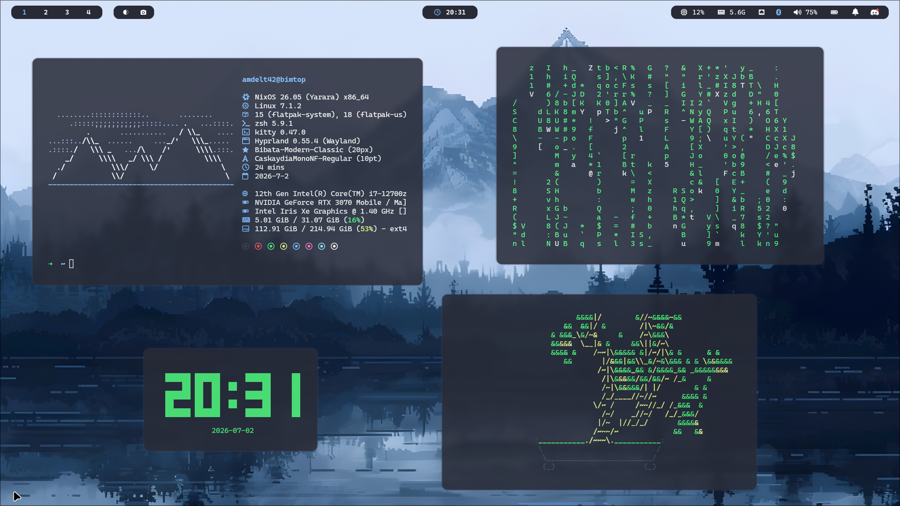

# BimOS

Personal collection of NixOS dotfiles, built as a multi-host modular flake from scratch. You can use this as a reference guide for your own system or try to install it yourself.

<p align="center">
  
</p>

> **Note:** This is a personal, evolving setup, not a polished framework. Hardware support is currently limited to Intel/Nvidia (no AMD yet), and the split between NixOS-level and home-manager-level modules for the same feature (e.g. Hyprland) isn't as clean as it could be. See [Known Issues](#known-issues--todo) for details.

## Table of Contents

- [Hosts](#hosts)
- [Structure](#structure)
- [Module System](#module-system)
- [Stack](#stack)
- [Installation](#installation)
- [Secrets](#secrets)
- [Known Issues / TODO](#known-issues--todo)
- [Credits](#credits)

## Hosts

| Host | Description |
|------|-------------|
| **bimtop**   | Primary desktop/laptop. Full desktop environment (Hyprland), theming, and dev tooling. |
| **bimserver** | Headless server. Minimal, deployed with an age-encrypted deploy key. |

Each host lives under `hosts/<name>/` with its own `configuration.nix`, `hardware-configuration.nix`, and `home.nix`, and is wired up in `flake.nix` via a shared `mkHost` builder.

## Structure

```
.
├── assets/           # Wallpapers, ASCII art, profile picture
├── config/           # Plain dotfiles, symlinked into place by home-manager (see note below)
├── hosts/            # Per-machine configuration, hardware config, and home-manager entrypoint
│   ├── bimserver/
│   └── bimtop/
├── modules/
│   ├── home-manager/ # User-level modules (apps, desktop, dev tooling, xdg)
│   └── nixos/        # System-level modules (apps, desktop, hardware, system services)
└── secrets/          # agenix-encrypted secrets
```

> **Live config:** Files under `config/` are symlinked into place by home-manager rather than copied, so most edits (Wofi, SwayNC, etc.) apply immediately, no rebuild needed. A few services (e.g. anything running as a daemon) or programs (Waybar) still need a restart to pick up changes.

## Module System

Every module under `modules/` is self-contained and optional. Modules expose their own `mkEnableOption`/`mkOption`s, so hosts can opt in per feature rather than inheriting a fixed configuration. This keeps `bimserver` lean while `bimtop` can enable the full desktop stack, and makes it straightforward to add a new host by toggling the modules as needed.

- `modules/nixos/` — system-level: hardware (bluetooth, camera, Intel/Nvidia), boot, networking, sound, services, agenix, autologin, stylix, and system-level apps.
- `modules/home-manager/` — user-level: desktop environment (Hyprland, Waybar, Wofi, SwayNC, Waypaper, Hyprlock), CLI apps (zsh, yazi, fastfetch, media/utils), development tooling, and XDG settings.

## Stack

- **Window manager:** [Hyprland](https://hyprland.org/)
- **Bar:** [Waybar](https://github.com/Alexays/Waybar)
- **Launcher:** [Wofi](https://github.com/SimplyCEO/wofi)
- **Notifications:** [SwayNC](https://github.com/ErikReider/SwayNotificationCenter)
- **Wallpaper:** [Waypaper](https://github.com/anufrievroman/waypaper) and [Awww](https://codeberg.org/LGFae/awww)
- **Theming:** [Stylix](https://github.com/nix-community/stylix)
- **Editor:** [NixVim](https://github.com/nix-community/nixvim) and [VSCode](https://github.com/microsoft/vscode)
- **Secrets:** [Agenix](https://github.com/ryantm/agenix)
- **Shell:** [Zsh](https://zsh.sourceforge.io/)
- **File manager:** [Yazi](https://github.com/sxyazi/yazi)

## Installation

> These configs are tailored to my hardware and usernames, treat this as a reference rather than a drop-in install.

1. Clone the repo to the path expected by `flakePath` (defaults to `/home/<user>/nixos-dotfiles`):
   ```bash
   git clone https://github.com/<you>/BimOS.git ~/nixos-dotfiles
   cd ~/nixos-dotfiles
   ```
2. Add or adjust a host under `hosts/<hostname>/`, including a matching `hardware-configuration.nix` (generate one with `nixos-generate-config`).
3. Register the host in `flake.nix` via `mkHost`.
4. Build and switch:
   ```bash
   sudo nixos-rebuild switch --flake .#<hostname>
   ```

## Secrets

Secrets are managed with [agenix](https://github.com/ryantm/agenix) and live encrypted in `secrets/`, where keyed off `secrets/.age` files live. You'll need your own keys set up before your own secrets will decrypt.

## Known Issues / TODO

- [ ] Remove remaining hardcoded paths scattered across a few modules (mostly quality-of-life)
- [ ] No AMD hardware module yet — only Intel and Nvidia are covered under `modules/nixos/hardware/`
- [ ] Introduce services such as Pi-Hole and others for the server host
- [ ] General cleanup pass as new hosts get added
- [ ] Split `config/hypr/hyprland.lua` into smaller, focused modules instead of one file

## Credits

Built on top of [nixpkgs](https://github.com/NixOS/nixpkgs), [home-manager](https://github.com/nix-community/home-manager), [stylix](https://github.com/nix-community/stylix), [nixvim](https://github.com/nix-community/nixvim), [agenix](https://github.com/ryantm/agenix), and [nix-flatpak](https://github.com/gmodena/nix-flatpak).
